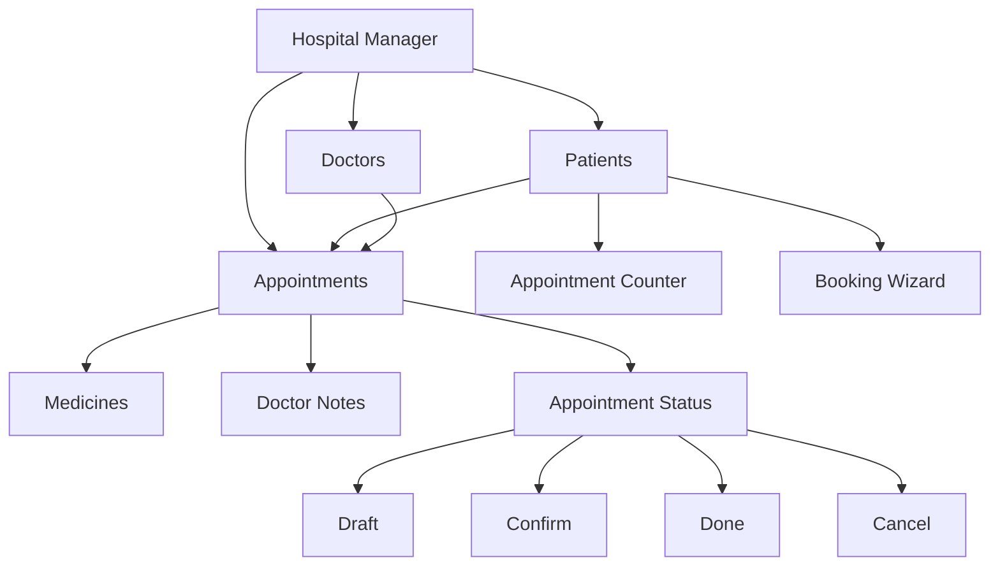

<div align="center">

# 🏥 Hospital Manager

### A Complete Hospital Management System Built with Odoo 17

<p>
  
  
  
  
</p>

<p>
  <a href="#-features">Features</a>
  •
  <a href="#-installation">Installation</a>
  •
  <a href="#-project-structure">Structure</a>
  •
  <a href="#-tech-stack">Tech Stack</a>
</p>

</div>

---

<div align="center">

## ✨ Hospital Management Made Simple

A custom **Odoo 17 module** designed to manage patients, doctors, appointments, medicines, and hospital operations through a clean and practical interface.

</div>

---

## 🚀 Features

<table>
<tr>
<td width="50%">

### 👤 Patient Management

* Create and manage patients
* Patient information
* Birthday & age tracking
* Patient appointment counter
* View patient's appointments
* Quick appointment booking

</td>

<td width="50%">

### 👨‍⚕️ Doctor Management

* Doctor management
* Doctor identification
* Doctor assignment
* Doctor-specific appointments
* Doctor notes

</td>
</tr>

<tr>
<td>

### 📅 Appointment Management

* Create appointments
* Automatic appointment numbers
* Assign patients
* Assign doctors
* Appointment date & time
* Appointment notes

</td>

<td>

### 🔄 Appointment Workflow

Appointments support multiple states:

`Draft` → `Confirm` → `Done`

with the ability to `Cancel` an appointment.

</td>
</tr>

<tr>
<td>

### 💊 Medicine / Prescription

* Add medicines to appointments
* Medicine notes
* One2many appointment relations
* Organized prescription entries

</td>

<td>

### 🔐 Security

* Access Control Lists
* Record Rules
* Doctor-based appointment visibility
* User permissions

</td>
</tr>
</table>

---

## 🧠 Technical Highlights

```text
Odoo 17
   │
   ├── Python
   │    ├── Odoo ORM
   │    ├── Models
   │    ├── Wizards
   │    └── Business Logic
   │
   ├── XML
   │    ├── Form Views
   │    ├── Tree Views
   │    ├── Kanban Views
   │    ├── Menus
   │    └── Actions
   │
   ├── Security
   │    ├── Access Rights
   │    └── Record Rules
   │
   └── PostgreSQL
```

---

## 🛠️ Tech Stack

| Technology           | Usage                        |
| -------------------- | ---------------------------- |
| 🟣 **Odoo 17**       | ERP Framework                |
| 🐍 **Python**        | Backend & Business Logic     |
| 🗄️ **PostgreSQL**   | Database                     |
| 🧩 **XML**           | Views, Menus & Actions       |
| 🔐 **Odoo Security** | Access Rights & Record Rules |
| 📦 **Odoo ORM**      | Database Operations          |

---

## ⚡ Installation

### 1️⃣ Clone the repository

```bash
git clone https://github.com/MohamedKhaleddd/odoo17-hospital-manager.git
```

### 2️⃣ Copy the module

Copy the `my_hospital` folder into your Odoo custom addons directory.

Example:

```text
odoo17/
└── projects/
    └── addons/
        └── my_hospital/
```

### 3️⃣ Add the addons path

Make sure your `odoo.conf` contains the custom addons directory:

```ini
addons_path = addons,projects/addons
```

### 4️⃣ Start Odoo

```bash
python odoo-bin -c ./odoo.conf
```

### 5️⃣ Update Apps List

From Odoo:

```text
Apps → Update Apps List
```

Then search for:

```text
Hospital Manager
```

and install the module.

---

## 📁 Project Structure

```text
my_hospital/
│
├── controllers/
│   ├── __init__.py
│   └── controllers.py
│
├── data/
│   └── data.xml
│
├── demo/
│   └── demo.xml
│
├── models/
│   ├── __init__.py
│   └── models.py
│
├── security/
│   ├── ir.model.access.csv
│   └── rule.xml
│
├── static/
│   └── description/
│       └── icon.png
│
├── views/
│   ├── appointment.xml
│   ├── doctor.xml
│   ├── medicines.xml
│   ├── menus.xml
│   ├── templates.xml
│   └── views.xml
│
├── wizards/
│   ├── __init__.py
│   ├── add_appointment.py
│   └── add_appointment.xml
│
├── __init__.py
└── __manifest__.py
```

---

## 🔄 Appointment Workflow

<div align="center">

```text
        ┌─────────┐
        │  Draft  │
        └────┬────┘
             │
             ▼
        ┌─────────┐
        │ Confirm │
        └────┬────┘
             │
             ▼
        ┌─────────┐
        │   Done  │
        └─────────┘

             │
             │
             ▼
        ┌─────────┐
        │ Cancel  │
        └─────────┘
```

</div>

---

## 🧩 Odoo Concepts Used

This project demonstrates several important Odoo development concepts:

* Models & ORM
* Model inheritance
* Relational fields
* `Many2one`
* `One2many`
* Related fields
* Computed fields
* Sequences
* XML Views
* Form Views
* Tree Views
* Kanban Views
* Wizards
* Window Actions
* Menus
* Security Access Rights
* Record Rules
* `mail.thread`
* `mail.activity.mixin`
* Chatter
* Domains
* Context
* Button actions
* Odoo module structure

---

## 📊 Module Architecture



---

## 🔐 Security

The module includes:

* Model Access Control
* User Permissions
* Appointment Record Rules
* Doctor-based appointment visibility

Security configuration:

```text
security/
├── ir.model.access.csv
└── rule.xml
```

---

## 🎯 Project Goals

The main goals of this project are:

* Practice Odoo 17 development
* Understand Odoo ORM
* Build custom business models
* Work with relational fields
* Implement real-world workflows
* Create custom views and menus
* Implement Odoo security
* Build reusable hospital management functionality

---

## 👨‍💻 Author

<div align="center">

### Mohamed Khaled

**Python Backend Developer | AI Integration**

<br>

<a href="https://github.com/MohamedKhaleddd">
  
</a>

</div>

---

## ⭐ Support

If you find this project useful, consider giving it a ⭐ on GitHub.

<div align="center">

### 🏥 Hospital Manager

**Built with ❤️ using Odoo 17 & Python**

</div>
